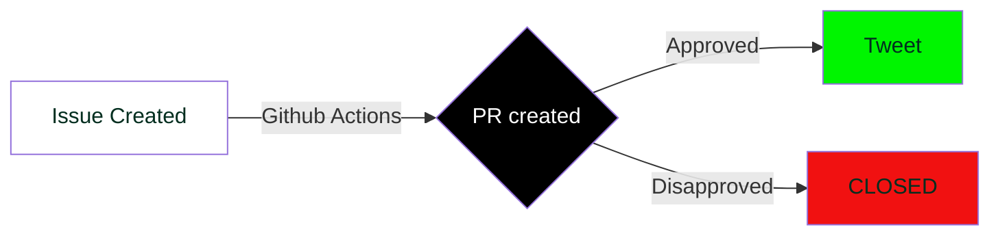

# KubeSimplify Tweets
Repo for automating kubeSimplify Tweets

[](https://github.com/kubesimplify/tweets/actions/workflows/main.yml)
[](https://github.com/kubesimplify/tweets/actions/workflows/twitter-together.yml)

Welcome🙏🏼 to the **tweets** repo of KUBESIMPLIFY.

We are targeting to automate the tweets of KUBESIMPLIFY

# Steps to post a tweet

WorkFlow diagram



# Contributing / Documentation

## Example

Create a new file `tweets/hello-world.tweet` with the content

> Hello, world!

You can use subfolders, e.g. `tweets/2019-02/hello-world.tweet`, as long as the file is in the `tweets/` folder and has a file with this file extension `.tweet`

## Create a tweet with a twitter poll

A tweet including a poll must end with 2-4 options in the following format
```
Here is some text

( ) option A
( ) option B
( ) option C
( ) option D
```
## Notes

- Only newly created files are handled, whereas deletions, updates or renames are ignored.
- ***.tweet** files will not be created for tweets you send out directly from twitter.com
- ⚠️If you need to rename an existing tweet file, please do so locally using [`git mv old_filename new_filename`](https://help.github.com/en/articles/renaming-a-file-using-the-command-line), otherwise it may occur as deleted and added which would trigger a new tweet.
- your message must fit into a single tweet

# Questions?

If you have any further questions or suggestions, please create an issue at https://github.com/gr2m/twitter-together/issues/new

# Step by Step Guide, How you can contribute here.

### Steps Involved

1. Fork this repo
    if successful, will be redirected to your github account
2. Open Terminal to clone from your github repo
```bash
git clone https://github.com/<username>/tweets
```

3. then you need to go inside the directory
```bash
cd tweets/
```
4. You need to set upstream url, run this command to do so:
```bash
git remote add upstream https://github.com/kubesimplify/tweets.git
# as best practice before creating a new branch
git pull upstream main --rebase
```

5. Run these commands to add a different branch:

You can have anything as <branch_name> , but by convention it should indicate what you are working on

example : <branch_name> can be **add-folder**, when you are adding your folder.

```bash
# next is to create a branch 
git branch <branch_name>
git checkout <branch_name>
```

For learning more about upstream or origin and github, Watch [Kunal Kushwaha's](https://www.youtube.com/watch?v=apGV9Kg7ics) or [freecodecamp](https://www.youtube.com/watch?v=RGOj5yH7evk) course on github.


⚠️**NOTE** : Always try to make separate branches for each task and make PRs using those branches. Keeping the main of your fork clean, is always a good idea.

- Make a directory with an appropriate name

```bash
mkdir <Dir_name>
```

# Steps to create a PR
```
git add .
git commit -m <Commit Message>
git push origin <branch_name> # this will push your changes to your github repo
```

- Go to your github forked repo, You will see an option to **"Compare and Pull request"**.
- Click on that and Then You will see an option to **"Create pull request"**. Click on that.
- That's it you have made your pull request.🥳
- After your request is accepted, You will see the folder of the directory name on the repository.
- We are waiting for your pull request.
- You can always have discussions regarding posting tweets on the [Discord Channel](https://saiyampathak.com/discord)

<a href = "https://github.com/kubesimplify/tweets/graphs/contributors">

</a>
Made with [contributors-img](https://contrib.rocks).